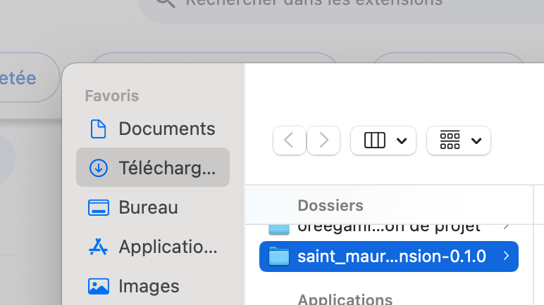

# Exportateur de Calendrier Périscolaire Saint-Maur
[](https://choosealicense.com/licenses/mit/)

Une extension Chrome pour exporter les réservations périscolaires du Portail Famille de Saint-Maur-des-Fossés au format ICS, facilitant l'importation dans les applications de calendrier.

Cette extension est fait en reverse engineering de l'API du Portail Famille de Saint-Maur-des-Fossés, c'est possible que l'API change et que l'extension ne fonctionne plus. Veillez retrouver plus d'info dans la section "Détail technique".

## Fonctionnalités

- Export des réservations périscolaires au format ICS
- Sélection de la période d'export (par mois)
- Configuration des rappels mensuels de paiement
- Support pour plusieurs enfants (à tester)
- Gestion des réservations annulées
- Gestion automatique de la session

## Installation

1. Téléchargez le derniere release depuis ce projet

2. Ouvrez Chrome et accédez à `chrome://extensions/`

3. Activez le "Mode développeur" en haut à droite
4. Cliquez sur "Charger l'extension non empaquetée" et sélectionnez le dossier de l'extension




## Utilisation

1. Connectez-vous au [Portail Famille](https://portalssl.agoraplus.fr/smdf/pck_home.home_view#/)
2. Cliquez sur l'icône de l'extension dans la barre d'outils Chrome une fois que vous êtes connecté
3. Sélectionnez la période à exporter
4. (Optionnel) Configurez un rappel mensuel de paiement
5. Cliquez sur "Download" pour générer et sauvegarder le fichier ICS

6. Importez le fichier ICS dans votre application de calendrier préférée (example google calandrier)
    a. Créez un nouveau calendier est fortement conseilée
    
    b. Importez le fichier .ics téléchargé
    
    c. Et Voila!


## Configuration

### Période
- Sélectionnez le mois et l'année de début
- Sélectionnez le mois et l'année de fin
- L'extension récupérera toutes les réservations de cette période

### Rappel de Paiement
- Sélectionnez un jour (1-28) pour les rappels mensuels
- Laissez vide pour désactiver les rappels
- Les rappels sont créés comme des événements sur toute la journée
- Sélectionner "No Reminder" annulera les rappels existants

## Prérequis

- Navigateur Google Chrome (version 131.0 ou supérieure)
- Compte Portail Famille actif
- Accès aux services périscolaires de Saint-Maur-des-Fossés

## Confidentialité

Cette extension :
- Accède uniquement au Portail Famille
- Ne stocke aucune donnée personnelle
- Traite toutes les données localement
- Ne transmet aucune donnée à des tiers

## Support

Pour les problèmes et demandes de fonctionnalités, veuillez créer une issue dans le dépôt GitHub.

## Détail technique

une fois que vous etes loggé sur le protail famille, on capture le value dans "SESSION_ID_smdf" dans local storage du navigator
et ce plugin fait ces API avec cet session id pour former notre fichier ICS d'export

1. recuperer les ids des enfants sous ce compte
GET https://smdf.agoraplus.fr/InternalApi/API_CALENDAR_COMPONENT/target/?idContext=1&idFamily=

Reponse body:
```
{
    "DATA": {
        "SHOW_ALL": 1,
        "TARGETS": [
            {
                "ID": "88888$0",
                "ID_TYPE_TARGET": 0,
                "NAME": "Zhitong",
                "LAST_NAME": "LIU",
                "PHOTO": null,
                "IS_ACTIVE": 1,
                "YEAR_OF_BIRTH": 20,
                "GENDER": "M",
                "HAS_SCHOOL_REG": 0
            }
        ]
    },
    "TYPE_RESULT": "1",
    "ERROR": {
        "ID": "0",
        "MESSAGE": ""
    }
}
```

2. recuperer les reservation d'un enfant (target)
GET https://smdf.agoraplus.fr/InternalApi/API_CALENDAR_COMPONENT/events/?idContext=1&targets=88888$0&startDate=01/01/2025&endDate=01/02/2025

Reponse body:
```
{
    "DATA": {
        "EVENTS": [
            {
                "ID_EVENT": 62,
                "DESCRIPTION": "RSM",
                "FULL_DESCRIPTION": "Restauration Scolaire - Maternel E.Cavell",
                "START_DATE_TIME": "06/01/2025 11:45:00",
                "END_DATE_TIME": "06/01/2025 13:45:00",
                "IS_SELECTED": 88888888,
                "IS_UNAVAILABLE": 0,
                "AVAILABLE_SLOT": 416,
                "ID_GROUP": 16,
                "NAME_GROUP": "Restauration Scolaire Maternelle",
                "SUB_EVENT_DESCRIPTION": "Repas",
                "SUB_EVENT_FULL_DESCRIPTION": "Repas (C)",
                "DAILY_ROULES_OBJ": {
                    "CAN_SUBSCRIPTION": 1,
                    "CAN_UNSUBSCRIPTION": 1,
                    "IS_MAJORED": 0,
                    "VACANCIES": 416,
                    "ID_MESSAGE": 1,
                    "INSERT_ABSENCE": 0
                },
                "SUB_EVENT_LIST": [
                    {
                        "ID_SUB_EVENT": -1,
                        "DESC_SUB_EVENT": null,
                        "PRICE": -1
                    },
                    {
                        "ID_SUB_EVENT": 484,
                        "DESC_SUB_EVENT": "Repas",
                        "PRICE": "8,88 "
                    }
                ],
                "ID_INSCRIPTION": 8888888,
                "ID_TARGET": "88888$0",
                "ID_CALENDAR": 88888,
                "IS_MAJORED": 0,
                "IS_BASKET": 0,
                "PRESENCE_TYPE": 0,
                "PRESENCE_VALUE": null,
                "ID_TYPE_TARGET": 0,
                "HAS_ALERT": 0,
                "ICON": null,
                "CONGES_LIST": null,
                "ACT_BLOCK_BY_CRITERIA": 0,
                "ID_FREQ": null
            },
            {
                "ID_EVENT": 1306,
                "DESCRIPTION": "ACSM",
                "FULL_DESCRIPTION": "Accueil Soir Maternel - Cavell",
                "START_DATE_TIME": "06/01/2025 16:30:00",
                "END_DATE_TIME": "06/01/2025 19:00:00",
                "IS_SELECTED": 0,
                "IS_UNAVAILABLE": 0,
                "AVAILABLE_SLOT": 114,
                "ID_GROUP": 21,
                "NAME_GROUP": "Accueil Soir Maternel",
                "SUB_EVENT_DESCRIPTION": null,
                "SUB_EVENT_FULL_DESCRIPTION": null,
                "DAILY_ROULES_OBJ": {
                    "CAN_SUBSCRIPTION": 1,
                    "CAN_UNSUBSCRIPTION": 1,
                    "IS_MAJORED": 0,
                    "VACANCIES": 114,
                    "ID_MESSAGE": 1,
                    "INSERT_ABSENCE": 0
                },
                "SUB_EVENT_LIST": [
                    {
                        "ID_SUB_EVENT": -1,
                        "DESC_SUB_EVENT": null,
                        "PRICE": -1
                    },
                    {
                        "ID_SUB_EVENT": 492,
                        "DESC_SUB_EVENT": "Soir mater",
                        "PRICE": "8,88 "
                    }
                ],
                "ID_INSCRIPTION": 8888888,
                "ID_TARGET": "88888$0",
                "ID_CALENDAR": 88888,
                "IS_MAJORED": 0,
                "IS_BASKET": 0,
                "PRESENCE_TYPE": 0,
                "PRESENCE_VALUE": null,
                "ID_TYPE_TARGET": 0,
                "HAS_ALERT": 0,
                "ICON": null,
                "CONGES_LIST": null,
                "ACT_BLOCK_BY_CRITERIA": 0,
                "ID_FREQ": null
            },
            {
                "ID_EVENT": 954,
                "DESCRIPTION": "Sortie Dérogatoire 17h- Maternel Edith Cavell",
                "FULL_DESCRIPTION": "Sortie Dérogatoire 17h- Maternel Edith Cavell",
                "START_DATE_TIME": "06/01/2025 16:30:00",
                "END_DATE_TIME": "06/01/2025 17:00:00",
                "IS_SELECTED": 0,
                "IS_UNAVAILABLE": 0,
                "AVAILABLE_SLOT": 112,
                "ID_GROUP": 81,
                "NAME_GROUP": "Sortie Dérogatoire 17h Maternelle",
                "SUB_EVENT_DESCRIPTION": null,
                "SUB_EVENT_FULL_DESCRIPTION": null,
                "DAILY_ROULES_OBJ": {
                    "CAN_SUBSCRIPTION": 1,
                    "CAN_UNSUBSCRIPTION": 1,
                    "IS_MAJORED": 0,
                    "VACANCIES": 112,
                    "ID_MESSAGE": 1,
                    "INSERT_ABSENCE": 0
                },
                "SUB_EVENT_LIST": [
                    {
                        "ID_SUB_EVENT": -1,
                        "DESC_SUB_EVENT": null,
                        "PRICE": -1
                    },
                    {
                        "ID_SUB_EVENT": 510,
                        "DESC_SUB_EVENT": "Sortie 17h",
                        "PRICE": "8,88 "
                    }
                ],
                "ID_INSCRIPTION": 8888888,
                "ID_TARGET": "88888$0",
                "ID_CALENDAR": 88888,
                "IS_MAJORED": 0,
                "IS_BASKET": 0,
                "PRESENCE_TYPE": 0,
                "PRESENCE_VALUE": null,
                "ID_TYPE_TARGET": 0,
                "HAS_ALERT": 0,
                "ICON": null,
                "CONGES_LIST": null,
                "ACT_BLOCK_BY_CRITERIA": 0,
                "ID_FREQ": null
            },
            {
                "ID_EVENT": 62,
                "DESCRIPTION": "RSM",
                "FULL_DESCRIPTION": "Restauration Scolaire - Maternel E.Cavell",
                "START_DATE_TIME": "07/01/2025 11:45:00",
                "END_DATE_TIME": "07/01/2025 13:45:00",
                "IS_SELECTED": 88888888,
                "IS_UNAVAILABLE": 0,
                "AVAILABLE_SLOT": 414,
                "ID_GROUP": 16,
                "NAME_GROUP": "Restauration Scolaire Maternelle",
                "SUB_EVENT_DESCRIPTION": "Repas",
                "SUB_EVENT_FULL_DESCRIPTION": "Repas (C)",
                "DAILY_ROULES_OBJ": {
                    "CAN_SUBSCRIPTION": 1,
                    "CAN_UNSUBSCRIPTION": 1,
                    "IS_MAJORED": 0,
                    "VACANCIES": 414,
                    "ID_MESSAGE": 1,
                    "INSERT_ABSENCE": 0
                },
                "SUB_EVENT_LIST": [
                    {
                        "ID_SUB_EVENT": -1,
                        "DESC_SUB_EVENT": null,
                        "PRICE": -1
                    },
                    {
                        "ID_SUB_EVENT": 484,
                        "DESC_SUB_EVENT": "Repas",
                        "PRICE": "8,88 "
                    }
                ],
                "ID_INSCRIPTION": 8888888,
                "ID_TARGET": "88888$0",
                "ID_CALENDAR": 88888,
                "IS_MAJORED": 0,
                "IS_BASKET": 0,
                "PRESENCE_TYPE": 0,
                "PRESENCE_VALUE": null,
                "ID_TYPE_TARGET": 0,
                "HAS_ALERT": 0,
                "ICON": null,
                "CONGES_LIST": null,
                "ACT_BLOCK_BY_CRITERIA": 0,
                "ID_FREQ": null
            },
            {
                "ID_EVENT": 1306,
                "DESCRIPTION": "ACSM",
                "FULL_DESCRIPTION": "Accueil Soir Maternel - Cavell",
                "START_DATE_TIME": "07/01/2025 16:30:00",
                "END_DATE_TIME": "07/01/2025 19:00:00",
                "IS_SELECTED": 88888888,
                "IS_UNAVAILABLE": 0,
                "AVAILABLE_SLOT": 110,
                "ID_GROUP": 21,
                "NAME_GROUP": "Accueil Soir Maternel",
                "SUB_EVENT_DESCRIPTION": "Soir mater",
                "SUB_EVENT_FULL_DESCRIPTION": "Accueil Soir Maternel (C)",
                "DAILY_ROULES_OBJ": {
                    "CAN_SUBSCRIPTION": 1,
                    "CAN_UNSUBSCRIPTION": 1,
                    "IS_MAJORED": 0,
                    "VACANCIES": 110,
                    "ID_MESSAGE": 1,
                    "INSERT_ABSENCE": 0
                },
                "SUB_EVENT_LIST": [
                    {
                        "ID_SUB_EVENT": -1,
                        "DESC_SUB_EVENT": null,
                        "PRICE": -1
                    },
                    {
                        "ID_SUB_EVENT": 492,
                        "DESC_SUB_EVENT": "Soir mater",
                        "PRICE": "8,88 "
                    }
                ],
                "ID_INSCRIPTION": 8888888,
                "ID_TARGET": "88888$0",
                "ID_CALENDAR": 88888,
                "IS_MAJORED": 0,
                "IS_BASKET": 0,
                "PRESENCE_TYPE": 0,
                "PRESENCE_VALUE": null,
                "ID_TYPE_TARGET": 0,
                "HAS_ALERT": 0,
                "ICON": null,
                "CONGES_LIST": null,
                "ACT_BLOCK_BY_CRITERIA": 0,
                "ID_FREQ": null
            },
            {
                "ID_EVENT": 954,
                "DESCRIPTION": "Sortie Dérogatoire 17h- Maternel Edith Cavell",
                "FULL_DESCRIPTION": "Sortie Dérogatoire 17h- Maternel Edith Cavell",
                "START_DATE_TIME": "07/01/2025 16:30:00",
                "END_DATE_TIME": "07/01/2025 17:00:00",
                "IS_SELECTED": 0,
                "IS_UNAVAILABLE": 0,
                "AVAILABLE_SLOT": 114,
                "ID_GROUP": 81,
                "NAME_GROUP": "Sortie Dérogatoire 17h Maternelle",
                "SUB_EVENT_DESCRIPTION": null,
                "SUB_EVENT_FULL_DESCRIPTION": null,
                "DAILY_ROULES_OBJ": {
                    "CAN_SUBSCRIPTION": 1,
                    "CAN_UNSUBSCRIPTION": 1,
                    "IS_MAJORED": 0,
                    "VACANCIES": 114,
                    "ID_MESSAGE": 1,
                    "INSERT_ABSENCE": 0
                },
                "SUB_EVENT_LIST": [
                    {
                        "ID_SUB_EVENT": -1,
                        "DESC_SUB_EVENT": null,
                        "PRICE": -1
                    },
                    {
                        "ID_SUB_EVENT": 510,
                        "DESC_SUB_EVENT": "Sortie 17h",
                        "PRICE": "3,24 "
                    }
                ],
                "ID_INSCRIPTION": 8888888,
                "ID_TARGET": "88888$0",
                "ID_CALENDAR": 88888,
                "IS_MAJORED": 0,
                "IS_BASKET": 0,
                "PRESENCE_TYPE": 0,
                "PRESENCE_VALUE": null,
                "ID_TYPE_TARGET": 0,
                "HAS_ALERT": 0,
                "ICON": null,
                "CONGES_LIST": null,
                "ACT_BLOCK_BY_CRITERIA": 0,
                "ID_FREQ": null
            },
            {
                "ID_EVENT": 1339,
                "DESCRIPTION": "ALSHM",
                "FULL_DESCRIPTION": "Accueil Mercredi Hors Restauration-Maternel E. Cavell",
                "START_DATE_TIME": "08/01/2025 07:30:00",
                "END_DATE_TIME": "08/01/2025 19:00:00",
                "IS_SELECTED": 88888888,
                "IS_UNAVAILABLE": 0,
                "AVAILABLE_SLOT": 114,
                "ID_GROUP": 23,
                "NAME_GROUP": "Accueil De Loisirs Mercredi Maternel",
                "SUB_EVENT_DESCRIPTION": "Journée+repas",
                "SUB_EVENT_FULL_DESCRIPTION": "AL Mercredi Journée (C)",
                "DAILY_ROULES_OBJ": {
                    "CAN_SUBSCRIPTION": 1,
                    "CAN_UNSUBSCRIPTION": 1,
                    "IS_MAJORED": 0,
                    "VACANCIES": 114,
                    "ID_MESSAGE": 1,
                    "INSERT_ABSENCE": 0
                },
                "SUB_EVENT_LIST": [
                    {
                        "ID_SUB_EVENT": -1,
                        "DESC_SUB_EVENT": null,
                        "PRICE": -1
                    },
                    {
                        "ID_SUB_EVENT": 505,
                        "DESC_SUB_EVENT": "Matin",
                        "PRICE": "7,37 "
                    },
                    {
                        "ID_SUB_EVENT": 509,
                        "DESC_SUB_EVENT": "Journée+repas",
                        "PRICE": "12,28 "
                    },
                    {
                        "ID_SUB_EVENT": 511,
                        "DESC_SUB_EVENT": "Matin+repas",
                        "PRICE": "7,37 "
                    }
                ],
                "ID_INSCRIPTION": 8888888,
                "ID_TARGET": "88888$0",
                "ID_CALENDAR": 88888,
                "IS_MAJORED": 0,
                "IS_BASKET": 0,
                "PRESENCE_TYPE": 0,
                "PRESENCE_VALUE": null,
                "ID_TYPE_TARGET": 0,
                "HAS_ALERT": 0,
                "ICON": null,
                "CONGES_LIST": null,
                "ACT_BLOCK_BY_CRITERIA": 0,
                "ID_FREQ": null
            }
        ]
    },
    "TYPE_RESULT": "1",
    "ERROR": {
        "ID": "0",
        "MESSAGE": ""
    }
}
```

## Licence

The MIT License (MIT)

Copyright (c) <2025> LIU Zhitong

Permission is hereby granted, free of charge, to any person obtaining a copy
of this software and associated documentation files (the "Software"), to deal
in the Software without restriction, including without limitation the rights
to use, copy, modify, merge, publish, distribute, sublicense, and/or sell
copies of the Software, and to permit persons to whom the Software is
furnished to do so, subject to the following conditions:

The above copyright notice and this permission notice shall be included in
all copies or substantial portions of the Software.

THE SOFTWARE IS PROVIDED "AS IS", WITHOUT WARRANTY OF ANY KIND, EXPRESS OR
IMPLIED, INCLUDING BUT NOT LIMITED TO THE WARRANTIES OF MERCHANTABILITY,
FITNESS FOR A PARTICULAR PURPOSE AND NONINFRINGEMENT. IN NO EVENT SHALL THE
AUTHORS OR COPYRIGHT HOLDERS BE LIABLE FOR ANY CLAIM, DAMAGES OR OTHER
LIABILITY, WHETHER IN AN ACTION OF CONTRACT, TORT OR OTHERWISE, ARISING FROM,
OUT OF OR IN CONNECTION WITH THE SOFTWARE OR THE USE OR OTHER DEALINGS IN
THE SOFTWARE.